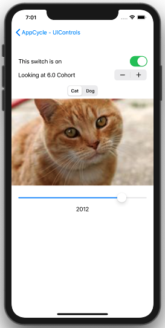

# AppLifeCycle-UIControls

In this app we went through the AppDelegate, SceneDelegate and ViewController life cycles. We continued through the lesson to introduce some UIControls including UIStepper and UISegmentedControl.

#### Vocabulary
* UINavigationController 
* Segue 
* UISwitch
* UIStepper 
* UISegmentedControl 
* UISlider
* Property Observers: didSet, willSet
* Image Literal

 

## [Lecture Video](https://youtu.be/stqGtoNubRM)   
